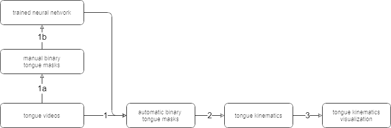

## Data preparation pipeline

The pieces of software here are used to prepare the high speed videos for analysis. The pipeline is outlined below:

### Step 1: High speed mouse lick video ==> Binary tongue mask videos
The [tongueSegmentationServer](tongueSegmentationServer), a python client/server application, employs a trained neural network (created in step 1b) to convert a video of a mouse tongue to a series of binary masks indicating which pixels in the video contain tongue, and which do not.
### Step 2: Binary tongue mask videos ==> Tongue kinematics
The [tongueTipTrackerApp](tongueTipTrackerApp), a MATLAB GUI, allows the user to analyze the binary mask stacks created by tongueSegmentationServer, and extract measures of tongue kinematics and geometry, stored in a .mat file.
### Step 3: Tongue kinematics ==4==> Visualization
The [tongueTipVisualizerApp](tongueTipVisualizerApp), a MATLAB GUI, is designed to flexibly visualize and explore the tongue kinematics data in one or more .mat files created by tongueTipTrackerApp. 
### Step 1a: High speed mouse lick video ==> Manually created binary tongue masks
The [manualObjectTracker](manualObjectTracker), a MATLAB GUI, allows the user to manually segment the tongue in mouse tongue videos to create training sets to train the neural networks used in step 1. 
### Step 1b: Manually created binary tongue masks ==> Trained neural network
The manually created tongue masks can be used to create a trained neural network that can subsequently automatically segment mouse tongues, saving a large amount of labor and reducing the possibility of experimenter bias.
