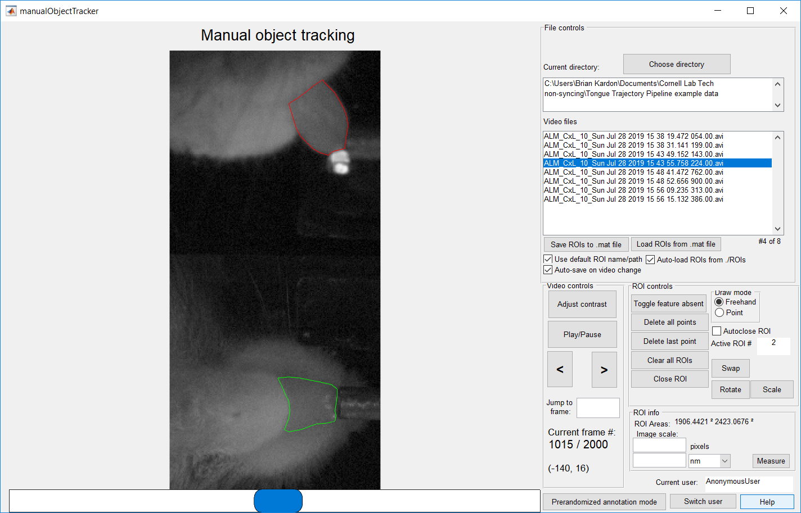
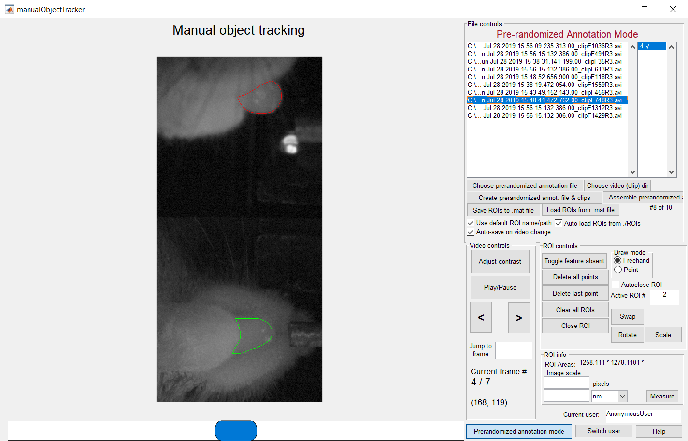

# manualObjectTracker User Manual
Manual object tracker is a MATLAB GUI designed to allow manual segmentation of objects in videos. Its intended use is the assembly of training sets for machine learning image segmentation algorithms.

Please note: this user manual is a work in progress

## System requirements

manualObjectTracker has been tested on MATLAB for Windows 10 versions 2017a and 2019a, but should work on any MATLAB version >= v9.6. It has not been tested on any non-Windows OS.

The following MATLAB toolboxes are required:
 - Image Processing Toolbox >= v10.4
 - Statistics and Machine Learning Toolbox >= v11.5

Manual segmentation of images requires a computer pointing device. Users report that the process is much easier, quicker, and more accurate with a stylus-type device, such as a Microsoft Surface Pen.

## Installation

1. Download/clone all files to your computer
2. Add the downloaded files to your [MATLAB path](https://www.mathworks.com/help/matlab/matlab_env/what-is-the-matlab-search-path.html)
3. To start the program, type "manualObjectTracker" into the MATLAB command line and press enter.

## Modes
Normal mode:
>Use when you simply have one or more videos, and you want to manually segment objects in the videos.

Prerandomized annotation mode:

> Use when you want to randomly sample frames to segment from a large set of videos. This can help prevent overtraining of the algorithm on a small number of videos by spreading out the training set over a large number of videos.

## How to annotate a video
- Click on the filename of a video clip in the list.
- Click or click-and-drag to draw a polygon around the feature. Alternatively you can use "Point" mode to select individual points in the frame.
- Various controls and keyboard shortcuts are described in the “help” dialogue (click the “Help” button). For example:
  - Right clicking will start and stop a zoom box to zoom in on the feature to allow more accurate annotations.
  - Pressing “a” will return the zoom level to normal.
  - Control-z will undo the last point entered.
- You can mark one or both features as "absent" in a frame by clicking the "Absent" button.
- If you want to label a second feature in the frame, pressing “1” or “2” will switch between labeling feature 1 or 2. You will likely want to stay consistent about which feature is 1 vs 2 from frame to frame.
  - At the moment, manualObjectTracker is designed to handle only two separate ROIs in each frame.
  - This is hardcoded, but can be easily changed by setting “handles.numROIs” to a different number.
- Advance to the next frame using the arrow keys or the "<" or ">" buttons
- By default, when you switch to a different video, your annotations will be automatically saved to disk.
  - You can also save them at any time by pressing the "Save ROIs to .mat file" button.
  - By default, the ROIs will be saved to a .mat file named with the video filename plus a suffix, within a subfolder of the video's folder named "ROIs".
  - This behavior can be changed with the various checkboxes under the "Save" button.

## Normal Workflow

1.	Optional: If you are planning to have multiple users independently segment the clips for validation:
    - Click the “Switch user” button, and “sign in” so you can annotate under your own user ID.
    - Otherwise, you can skip this step to use the default AnonymousUser.
2. Select a directory that contains videos by clicking "Choose directory"
3. Select the video that you want to annotate from the video list
4. Manually segment the feature of interest in each frame of each video (see the [How to annotate](#How-to-annotate-a-video) section)

## Prerandomized Annotation Workflow

1. Switch to prerandomized annotation mode by clicking the "Prerandomized Annotation Mode" button.
2. Create a prerandomized annotation file and associated video clips
    - This step allows you to randomly sample frames from an arbitrary number of videos to create a more balanced training set.
    -	The result of this step is a prerandomized annotation file, and a set of video clips, each consisting of a sampled frame, and several frames on either side (having several frames around each sampled frame can make visual segmentation easier).
    -	Click the “Create prerandomized annotation file” button. Use the popup to specify which videos to sample from, how many sample frames to take, and other parameters.
--	You can also do this from the command line – if you’ve done this, you can skip this step and choose an existing video clip directory and prerandomized annotation file instead.
3.	Optional: If you are planning to have multiple users independently segment the clips for validation:
    - Click the “Switch user” button, and “sign in” so you can annotate under your own user ID.
    - Otherwise, you can skip this step to use the default AnonymousUser.
4.	Manually segment the feature of interest in each random video clip. (see the [How to annotate](#How-to-annotate-a-video) section)
    - In this mode, the “center” frame of the clip, which should be the one to initially load, is the only one you should manually segment. You do not need to segment any of the other frames, as they are only there to help visually identify the feature through motion.

## Output format
The annotations are saved to disk in .mat files, each containing a struct with the annotation data. The data structure is as follows:

- outputStruct: class struct 1 x 1
  - Fields:
	- videoFile: class char 1 x 57 = name of the video file that this annotation corresponds to
	- videoSize: class double 1 x 3 = video size (H x W x N)
	- ROIData: class struct 1 x 1 = struct holding all annotation data
	- Fields:
		- AnonymousUser: class struct 1 x 1 = struct holding the annotation data for this user
		- Fields:
			- xFreehands: class cell 2 x N = x coordinates of points marked in "Freehand" mode for each frame
			- yFreehands: class cell 2 x N = y coordinates of points marked in "Freehand" mode for each frame
      - xPoints: class cell 2 x N = x coordinates of points marked in "Point" mode for each frame
			- yPoints: class cell 2 x N = y coordinates of points marked in "Point" mode for each frame
			- xProj: class cell 2 x N = for backwards compatibility, not in use
			- zProj: class cell 2 x N = for backwards compatibility, not in use
			- absent: class logical 2 x N = boolean indicating if each feature is absent in each frame
			- stats: class struct 1 x 1
			- Fields:
				- areaUnits: for future use
				- areaPixels: for future use
				- pixelScaleMeasurement: for future use
				- unitScaleMeasurement: for future use
				- scaleUnit: for future use
	- manualObjectTrackerVersion: class char 1 x 4 = manualObjectTracker version that created this file
